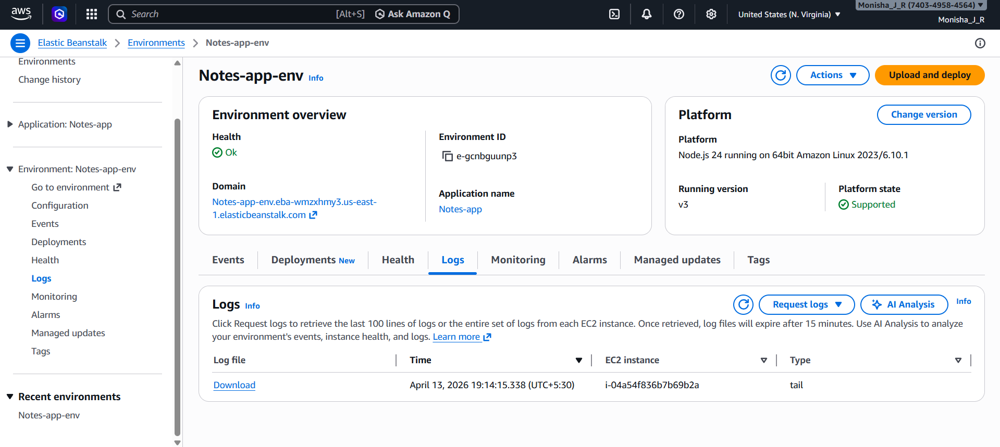
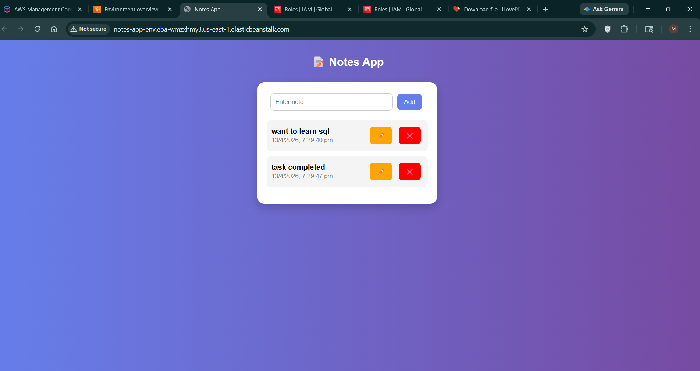

# Notes App

A simple Notes Web Application built using Node.js, Express.js, and MongoDB.

## Features
- Create notes
- View notes
- Update notes
- Delete notes

## Tech Stack
- Node.js
- Express.js
- MongoDB
- AWS Elastic Beanstalk (EBS)

## Deployment

The application was deployed using AWS Elastic Beanstalk.  
Deployment screenshots are included below.

## Screenshots

### AWS Deployment

### Application Output

## Learning Outcomes
- Backend development using Node.js
- Database integration with MongoDB
- Cloud deployment using AWS Elastic Beanstalk
- Debugging real-world deployment issues
